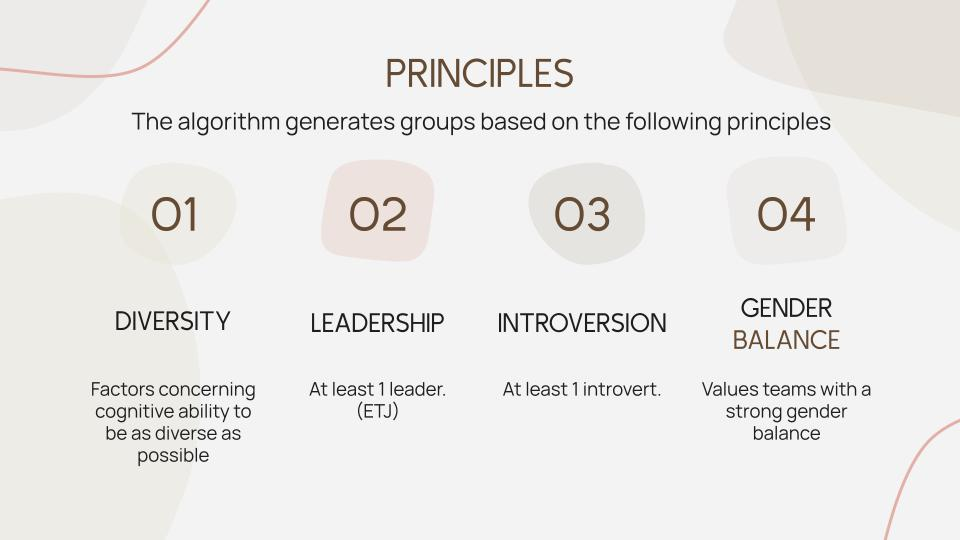

# 🎓 Synergy: Optimized Student Grouping for Classroom Success 🚀


## 🌟 Introduction

Welcome to **Synergy**! Enhancing classroom collaboration and performance by creating optimized student groups under the UWCSEA 50th anniversary innovation grant. Synergy uses an algorithm to generate well-balanced and diverse groups based on students' personality traits. The project aims to support teachers in fostering a productive and inclusive learning environment for all students.


## 🛠️ Tech Stack

- Frontend: React.js
- Backend: Node.js, Express
- Database: MongoDB
- UWCSEA CIMS System (REST API)

## 🧪 Algorithm

Synergy uses an innovative algorithm to create optimized groups of students based on their personality traits derived from the Post-Jungian (PJ) personality theory. The PJ personality theory is an extension of Carl Jung's psychological types and consists of four dimensions:

1. SN (Sensing vs Intuition)
2. TF (Thinking vs Feeling)
3. EI (Extroversion vs Introversion)
4. PJ (Perception vs Judgment)

Students complete a 20-question personality quiz, with answers ranging from 1 to 4. These answers are then mapped to a four-dimensional vector based on the PJ personality theory dimensions. The personality vectors of all students in a class are used by the algorithm to compute k-sized groups that optimize the utility function.

The algorithm creates groups based on the following principles:

1. Cognitive Diversity: Values teams with diverse SN (Sensing vs Intuition) and TF (Thinking vs Feeling) personality dimensions.
2. Leadership: Values teams with at least one ETJ agent (the leader).
3. Introversion: Values teams with at least one introvert.
4. Gender Balance: Values teams with a strong gender balance.

The algorithm computes the optimal partition of a class of students to maximize the product of utility functions of each individual group. Instead of using a brute force method, Synergy employs a greedy algorithm that quickly finds an initial solution and repeatedly improves it through crossover operations. This results in a 99.6% average optimality ratio and a 0.267% average time ratio compared to the brute force method.



## 💻 Web Application

Synergy is available as an easy-to-use web application that offers the following features:

1. Simple form for teachers to input their class code, teacher code, and desired group size (k).
2. Option for teachers to specify students who must or must not be in the same group.
3. Integration with the UWCSEA CIMS system for seamless access to student data.
4. Built-in form for students to complete the personality quiz based on the Post-Jungian (PJ) personality theory.
5. Secure storage of students' personality data in a MongoDB database.


## 📊 Results

Synergy has been tested in real-world classroom settings and demonstrated significant improvement in group performance compared to self-selected and randomized groups. On average, groups formed by our algorithm performed 35.9% better than self-selected groups.

## 🛠️ Installation & Setup

1. Clone the repository:

```
git clone https://github.com/yourusername/synergy.git
```

2. Install the dependencies:

```
cd synergy
npm install
```

3. Start the backend development server:

```
npx nodemon
```

4. In a new terminal window, navigate to the `client` folder and install the frontend dependencies:

```
cd client
npm install
```

5. Start the frontend development server:

```
npm start
```

6. Open your browser and navigate to `http://localhost:3000` to access the Synergy web application.

## 📜 License

This project is licensed under the MIT License - see the [LICENSE](LICENSE) file for details.

## 🌱 Future Steps

We are exploring additional enhancements to Synergy, such as:

- Incorporating the Five Factor Model (FFM) for personality assessment.
- Allowing teachers to input student affiliations.
- Enabling students to provide names of preferred team members.
- Taking student grades and other performance metrics into account.

## 📚 References

- [Momani & Stirk (Diversity Dividend Canada’s Global Advantage)](www.cigionline.org/static/documents/documents/DiversitySpecial%20Report%20WEB_0.pdf)
- [Nathan & Lee (Cultural Diversity, Innovation, and Entrepreneurship)](www.tandfonline.com/doi/abs/10.1111/ecge.12016)
- [Tolsma et al. (Who Is Bullying Whom in Ethnically Diverse Primary Schools?)](https://doi.org/10.1016/j.socnet.2012.12.002)
- [Jimerson (Advancing Diversity, Equity, and Inclusion in School Psychology)](www.tandfonline.com/doi/full/10.1080/2372966X.2021.1889938)
- [Judge et al. (Personality and Leadership: A Qualitative and Quantitative Review)](https://doi.org/10.1037/0021-9010.87.4.765)
- [Andrejczuk et al. (Synergistic Team Composition: A Computational Approach to Foster Diversity in Teams)](https://doi.org/10.1016/j.knosys.2019.06.007)
- [Rands & Gansemer-Topf (The Room Itself Is Active: How Classroom Design Impacts Student Engagement)](files.eric.ed.gov/fulltext/EJ1152568.pdf)
- [Barbuto (A Critique of the Myers-Briggs Type Indicator and Its Operationalization of Carl Jung’s Psychological Types)](https://doi.org/10.2466/pr0.1997.80.2.611)


